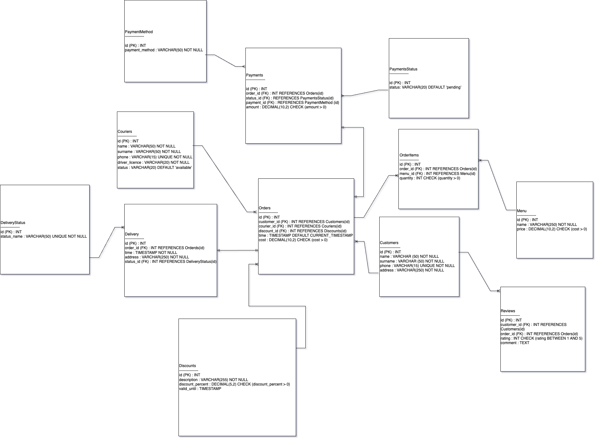

# Sushi Restaurant Database Model

This project contains a logical data model (ERD) for a small sushi restaurant that accepts and delivers orders using couriers.

The model is normalized to the **Third Normal Form (3NF)** and includes:

- Orders (composition, cost, order time)
- Delivery details (time, district, street)
- Courier data
- Customer data
- Menu items
- Relationships and constraints (PK, FK, UNIQUE, NOT NULL)

## Diagram

> Created as part of an educational SQL and database design assignment.

## Skills demonstrated

- Conceptual data modeling  
- Relational structure design  
- Normalization to 3NF  
- Identifying primary/foreign keys and constraints

